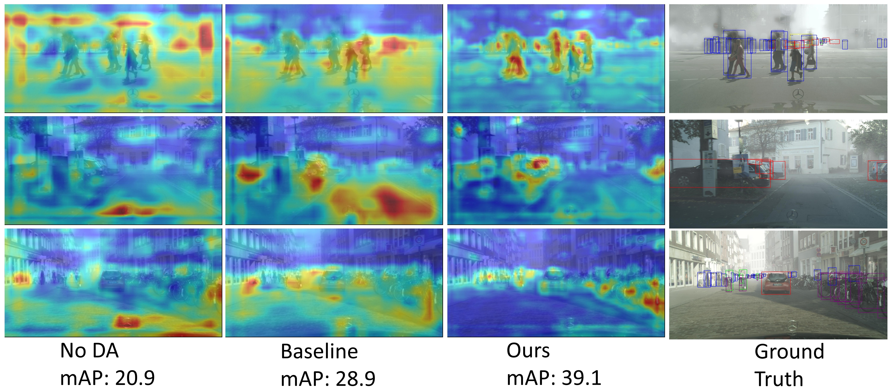
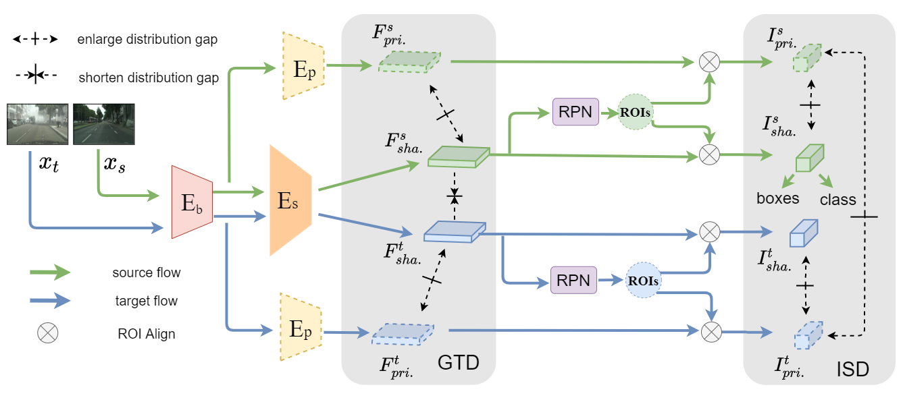

# Decompose to Adapt: Cross-domain Object Detection via Feature Disentanglement

In this project, we proposed a Domain Disentanglement Faster-RCNN (DDF) for cross-domain object detection, from the view of feature disentanglement.

The implementations are for our paper published in IEEE Transactions on Multimedia:

[Decompose to Adapt: Cross-domain Object Detection via Feature Disentanglement](https://arxiv.org/abs/2201.01929)

**The overall code will be released later on.

## Visual Examples of the features

## Our proposed framework: Domain Disentanglement Faster-RCNN (DDF)

## Contact

Please contact Dongnan Liu (dongnanliu0201@gmail.com) regarding any issues.

## License

DDF is released under the MIT license. See [LICENSE](LICENSE) for additional details.